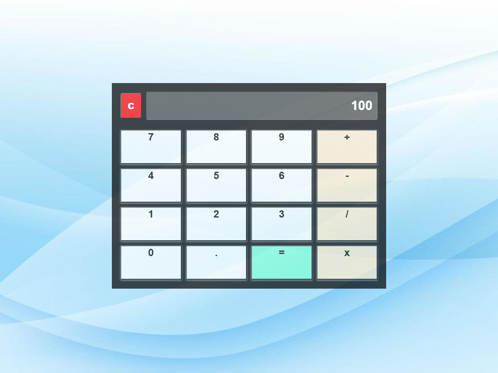

# IT Assignment 06 - Standard Calculator

A sleek, responsive web-based calculator built using HTML, CSS, and JavaScript. This project was developed as part of an IT assignment to demonstrate front-end development and basic arithmetic logic.

## 📱 User Interface
Below is a preview of the Calculator UI:


*(Note: Please ensure the image exists in your asserts/images folder or update the path above)*

---

## 🚀 Features
- **Basic Arithmetic:** Supports addition, subtraction, multiplication, and division.
- **Responsive Design:** Fully optimized for both desktop and mobile screens.
- **Clear & Delete:** Functions to clear the entire screen or delete the last digit.
- **Glassmorphism UI:** Modern styling with smooth button transitions.
- **Firebase Deployment:** Configured for hosting via Firebase.

---

## 🛠️ Technologies Used
- **HTML5:** For the structural layout.
- **CSS3:** For custom styling and responsive UI.
- **JavaScript (ES6):** For calculation logic and DOM manipulation.
- **Firebase:** Tools used for project configuration and deployment.

---

## 📂 Project Structure
```text
├── asserts/          # Icons and UI images
├── css/              # Stylesheets
├── js/               # Logic and functionality scripts
├── index.html        # Main entry point
├── firebase.json     # Firebase configuration
└── .firebaserc       # Firebase project aliases


